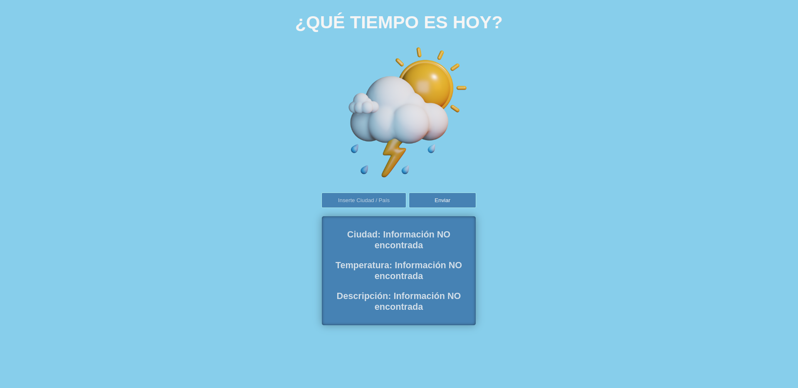

# Web App de Clima 🌦️



## Descripción
Esta aplicación web proporciona información sobre el clima actual de una ciudad o país ingresado por el usuario. Utiliza JavaScript puro junto con HTML y CSS para crear una experiencia interactiva y visualmente atractiva. Los datos del clima se obtienen de una API externa y se presentan de manera clara y concisa en la interfaz de usuario.

## Características principales
- **Búsqueda de clima 🔍:** Los usuarios pueden ingresar el nombre de una ciudad o país para obtener la información meteorológica correspondiente.
- **Datos mostrados 🌍:**
  - Ciudad o país 🗺️.
  - Temperatura 🌡️ (redondeada a 2 decimales usando `toFixed`).
  - Descripción del clima ☁️.
  - Humedad 🍃.
  - Presión ⏱️.
  - Nivel del mar 🌊.
  - Visibilidad 🌫️.

- **Interactividad 🖱️:**
  - El botón "Enviar" inicia la búsqueda.
  - El botón de enviar, pasa a cargarse.
  - Se muestra mensaje de que se ha recibido la información ó la información no se ha encontrado, deberá escribir la ciudad o país para averiguarlo.
  - Los datos se actualizan dinámicamente en la página sin necesidad de recargarla.
  - Al acerca el puntero del cursor en algunas de las dos tarjetas con información del clima, se verá un efecto Blur y segirará ligeramente hacía el lado izquierdo.

## 🗂️ Estructura del proyecto

```
repo/
|-- .gitignore        # Ignora archivos
|-- .env              # Protección de API Key
|-- index.html        # Estructura principal de la aplicación
|-- index.css         # Estilos personalizados
|-- index.js          # Lógica de la aplicación
|-- package.json      # Estructura de comandos de paquetes instalados
|-- package-lock.json # Historial de paquetes instalados
|-- preview-website   # Imagen PNG vista previa del sitio web
|-- README.md         # Introducción del proyecto
|-- vite.config.js    # Configuración de Vite

```

## Tecnologías utilizadas
- **HTML5:** Para estructurar el contenido de la aplicación.
- **CSS3:** Para diseñar y estilizar la interfaz de usuario.
- **JavaScript:** Para implementar la lógica de la aplicación y manejar la interacción con el usuario.
- **Vite:** Para el manejo de la lógica en el servidor (BackEnd) y evitar problemas con el CORS, entorno de variables y la instalación de paquetes en desuso.

## Detalles técnicos
- **API de clima 🌐:** La aplicación utiliza una API externa para obtener datos en tiempo real.
- **fetch 🔄:** Se utiliza para realizar consultas HTTP a la API.
- **toFixed 🧮:** Para redondear la temperatura a dos decimales antes de mostrarla.
- **DOM ✏️:** Manipulación directa para actualizar el contenido dinámicamente.

## Cómo usar el repositorio
1. Clonar el repositorio o descargar los archivos. 📥
2. Abrir el archivo `index.html` en un navegador web. 🌐
3. Ingresar el nombre de una ciudad o país en el campo de entrada. 🏙️
4. Hacer clic en el botón "Enviar". ➡️
5. Ver la información del clima actualizada en la pantalla. ☀️

## Contribuciones 🤝
Si deseas contribuir a este proyecto, siéntete libre de enviar un pull request o reportar problemas en el repositorio. 🛠️
